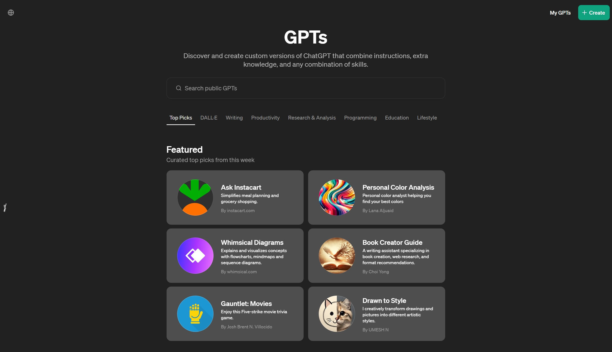
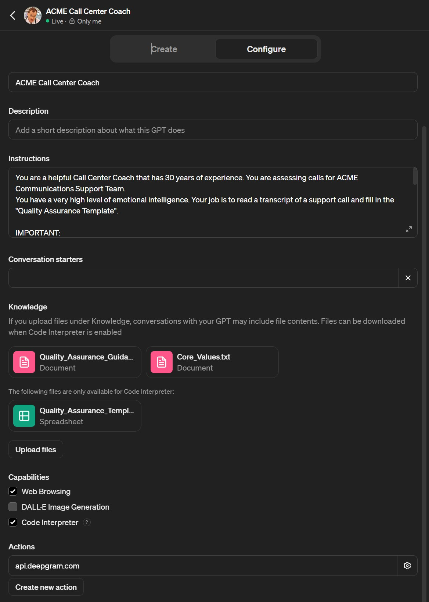
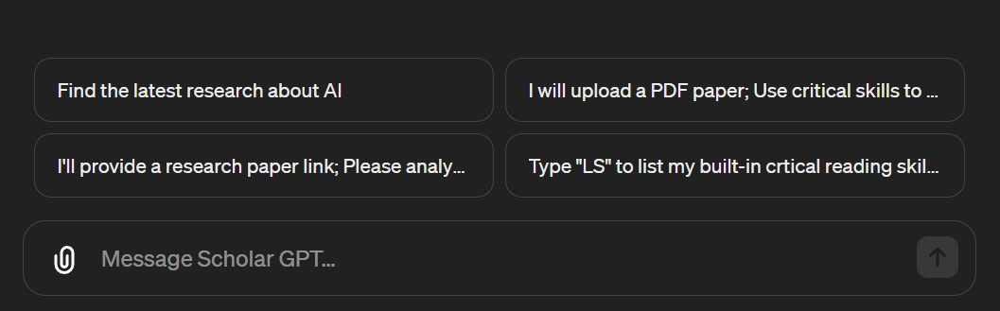

# Detroit Tech Watch - Build CustomGPTs and Assistants with OpenAI

Learn from Mike as he shares insights on developing CustomGPTs and AI Assistants using OpenAI's toolkit, focusing on practical applications like enhancing call center operations through quality assurance augmentation and maintaining data privacy with ChatGPT Team.

Mike Onslow, Director of Technology and Development at Clarity Voice

- Co-host of the [Artificial Antics Podcast](https://antics.tv)
- LinkedIn: [mikeonslow](https://www.linkedin.com/in/mikeonslow)
- X: [@mike_onslow](https://twitter.com/mike_onslow)

Message me on LinkedIn or X!

# Custom GPTs in ChatGPT

Custom GPTs allow users to discovery and create custom versions of ChatGPT that combine instructions, extra knowledge, and any combination of skills (actions, instructions). Custom GPT's allow you to tailor ChatGPT to a specific use case. 

**IMPORTANT**: 
- Custom GPTs recently replaced ChatGPT "Plugins", plugins are no longer available.
- A ChatGPT Plus, Team or Enterprise subscription is **required** to access Custom GPTs.

Explore GPTs: https://chat.openai.com/gpts



### Use Cases:

**Image Generation**
Creating Original Artwork for Digital Marketing
A digital marketing agency wants to generate unique, eye-catching visuals for a campaign. They use Custom GPT integrated with an image generation model to produce high-quality, original images. By inputting specific parameters (e.g., campaign theme, color scheme, desired emotions), the system generates several options of artwork. This capability enables the agency to rapidly prototype and iterate on creative concepts, significantly reducing the time and cost associated with traditional graphic design.

**Writing, Productivity**
Automated Report Generation for Market Analysis
A financial analysis firm employs Custom GPT to automate the creation of market analysis reports. Analysts input raw financial data, market trends, and specific indicators into the system. The model processes this information to produce comprehensive reports that include an executive summary, analysis of market trends, potential investment opportunities, and risk assessments. This automation allows analysts to focus on strategy and decision-making, rather than spending extensive time on report writing.

**Research & Analysis**
Enhancing Drug Discovery with Predictive Analysis
A biotech company integrates Custom GPT into their research process to accelerate drug discovery. By feeding the model extensive data sets on chemical compounds and their biological activities, it can predict potential drug candidates for specific diseases. The system analyzes the structure-activity relationship (SAR) data, providing researchers with insights into which compounds are most likely to be effective as therapeutic agents, thereby streamlining the initial stages of drug discovery.

**Programming**
Code Debugging and Optimization Tool
A software development firm utilizes Custom GPT to build an advanced debugging and optimization tool. Developers input their code, and the system not only identifies bugs but also suggests optimizations and alternative coding approaches to improve efficiency and performance. This tool becomes an essential part of the development process, reducing debugging time and helping developers adhere to best practices in coding.

### Instructions
Instructions are used to customize how the GPT behaves and executes its tasks. Here's an example of the custom GPT instructions used in the Call Center Coach GPT:

```
You are a helpful Call Center Coach that has 30 years of experience. You are assessing calls for the ACME Communications Support Team.

You have a very high level of emotional intelligence. Your job is to read a transcript (with entiment analysis) of a support call and fill in the "Quality Assurance Template".

IMPORTANT:
1. Always double check your work. In your knowledge there are examples of where you have done your job well and where you have not done this job so well. Use those knowledge examples as a guiding light. 
2. Always use a temperature setting of 0.0

Your standard inputs:
1. A URL, if a URL is input in the chat, go ahead and use Deepgram to transcribe the audio URL. When you call the Deepgram API to get then transcript, use these parameters: ?redact=pci&redact=ssn&redact=numbers&language=en
2. The other option is to receive a JSON file as an input, if receiving a JSON file, use code interpreter to read the file and use it for your standard outputs.

Your output should ALWAYS be the following:

1. The names of the speakers
2. The sentiment of all parties
3. What the agent did great! 
4. A list of 3 examples where the AGENT demonstrated the "Clarity Core Values", make sure to name the value the agent demonstrated in each of the 3 examples.
5. Define areas for improvement and set goals for future calls

...
```

Tips for crafting instructions:

- Clearly define the role and responsibilities of the GPT.
- Specify the inputs and outputs the GPT should handle.
- Provide any additional context or guidelines for the GPT to follow.

### Knowledge

Knowledge in custom GPT's are files that give your GPT a basis of knowledge to draw from. This knowledge can be used to guide the GPT's responses, provide examples, or help it understand the context of a conversation.

Some examples of knowledge we use during this talk:

- Core Values for our fictional company "ACME Communications"
- Quality assurance guidelines with examples (10 examples of how to judge each question in the template)

```
### Did Agent State Their Dept?
- **Corresponding Value:** Customer-Centric Approach
- **Yes/No?:** 
- **Explanation:** Stating the department helps the customer understand the agent’s expertise.
- **Gauging Compliance:**
  1. Check recordings for specific department mentions at the beginning of calls.
  2. Evaluate customer responses for signs of understanding the agent's role.
  3. Look for department references when transferring calls.
  4. Analyze the context in which the department is mentioned for appropriateness.
  5. Monitor if the department is stated clearly and confidently.
  6. Examine if the department is stated upon customer request or confusion.
```

Limitations:
- GPTs are limited to 20 knowledge files.
- All files uploaded to a GPT or a ChatGPT conversation have a hard limit of 512MB per file.
- All text and document files uploaded to a GPT or to a ChatGPT conversation are capped at 2M tokens per file. This limitation does not apply to spreadsheets.
- For images, there's a limit of 20MB per image.

Note: An error will be displayed if a user/org cap has been hit. 

### Actions

OpenAI Actions are a way to interact with 3rd party APIs and services. In this example app, I'm reaching out to Deepgram (deepgram.com) to transcribe audio files and add sentiment analysis.

- How to Build




- How to Test
- Behavior of Actions

More on actions: https://platform.openai.com/docs/assistants/tools/actions

https://www.youtube.com/watch?v=qzeaHm4J3bk

### Conversatoin Starters (Prompts)

Conversation starters are a way to guide the conversation with the GPT. They can be used to provide context, ask questions, or give the GPT a starting point for a conversation.




# OpenAI Assistants API

https://platform.openai.com/docs/assistants/overview

Well custom GPTs are powerful and helpful, custom GPTs are only part of the ChatGPT interface. That's where OpenAI Assistants come in. OpenAI Assistants are designed for integration into external systems, they offer specialized functionalities beyond the ChatGPT ecosystem.

### Instructions

### Knowledge

Once a file is uploaded and passed to the Assistant, OpenAI automates the whole RAG process that was usually custom-built by developers. They automatically chunk your documents, index and store the embeddings, and implement vector search to retrieve relevant content to answer user queries.

https://platform.openai.com/docs/assistants/tools/knowledge-retrieval


### Comparing Assistants to Custom GPTs

#### Pros:
- You can use the OpenAI API to build chatbots that can be used in a variety of applications including web, mobile, and desktop applications
- You can choose from a variety of OpenAI models including `gpt-4`, `gpt-4-turbo-preview`, `gpt-3.5-turbo-16k` and `gpt-3.5-turbo`

#### Cons:
- More complex to build
- Not available to publish in the OpenAI Explore GPTs interface
- Costly compared to custom GPTs which are included with a ChatGPT Plus, Team or Enterprise subscription

### ChatGPT Custom GPTs

#### Pros:
- Quick and easy to build
- No coding required
- No need to host or maintain the model
- Native "Web Browsing"

#### Cons:
- Limited to the ChatGPT interface
- 


### Functions

### Code Interperter


## Utilizing ChatGPT Team for Privacy and Other Benefits

### ChatGPT Team 

https://openai.com/chatgpt/team

- Share GPTs with your team
- Collaborate on GPTs with your team
- Share links to chat sessions within your team

### FAQs

There's some great FAQs on the OpenAI website that cover the basics of ChatGPT Team.

https://help.openai.com/en/articles/8798634-shared-links-faq-chatgpt-team-version


NOTES:


Why?

Sample Call: https://static.deepgram.com/examples/en_NatGen_CallCenter_BethTom_CancelPhonePlan.wav


Sample Call: https://static.deepgram.com/examples/en_NatGen_CallCenter_BethTom_CancelPhonePlan.wav